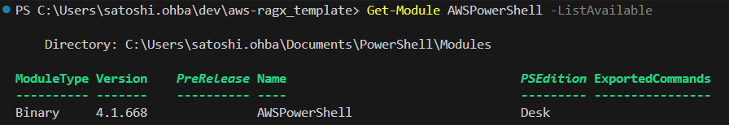
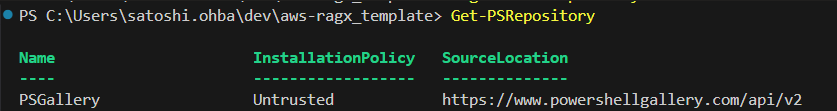

# AWSPowerShellモジュールのinstall方法
UpdateAwsCredentials.ps1 を実行するためには、AWSPowerShellモジュールのインストールが必要です。
windows11環境において、このモジュールをインストールする方法を記載します。(動作確認済みversionは、4.1.668)

## step1: AWSPowerShellのインストール有無確認
下記コマンドを実行し、AWSPowerShell モジュールの有無を確認する。
```powershell
Get-Module AWSPowerShell -ListAvailable
```
この時、下記のような出力がなければ、AWSPowerShellが未インストールなのでインストール操作が必要。


## step2: インストール元repositoryの登録
AWSPowerShell モジュールのインストールには、インストール元のrepository を登録する必要がある。
```powershell
 Get-PSRepository 
```
個の戻り値が
WARNING: Unable to find module repositories. 
等であった場合は、repository の登録がされていないため、下記コマンドで PSRepository を登録する。
```powershell
Register-PSRepository -Default
```
再度、Get-PSRepository コマンドを叩くと、下記画像のように repository が登録されている。



## step3: AWSPowerShellモジュールのインストール
下記コマンドを実行 (途中の質問は Y の回答でOK)
```powershell
Install-Module -Name AWSPowerShell
```
インストールが完了したことを、下記コマンドで確認する。
```powershell
Get-Module AWSPowerShell -ListAvailable
```
すると下記のように、AWSPowerShell のインストール完了を確認できる。

