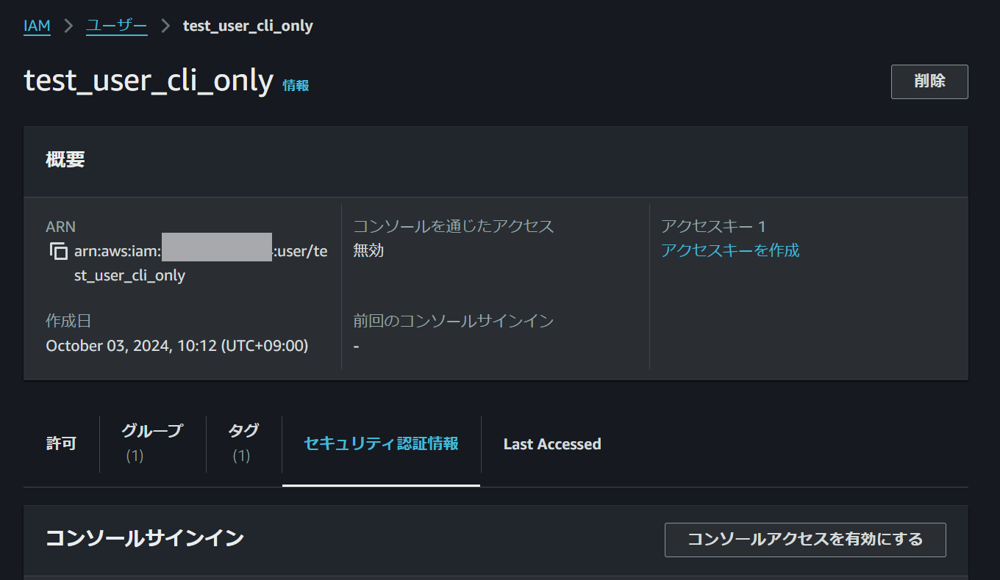
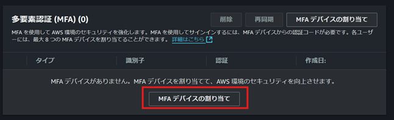
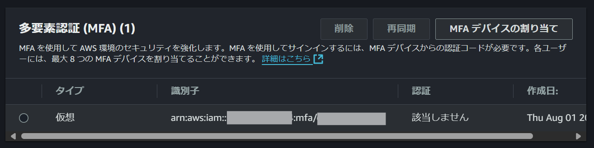
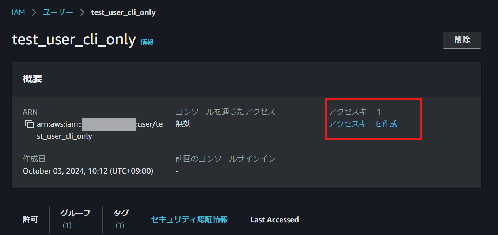

# update-aws-credentials

## ◎AWS STS を使ったセキュアな認証を簡便にするツールです。

AWS CLI を使う際、セキュアな認証方法の一つとして、AWS STS を使って一時認証情報を取得し、その情報を .aws/credentials ファイルに都度記載する、という方法があります。
この方法は手動操作が多く、sts コマンドも長いため、セッションの有効期限が切れるたびに行うのは面倒です。

そこで、この操作を自動化可能な部分は自動化し、一行の短いコマンドのみで行えるようにした powershell スクリプトを作成しました。

## 使い方

### 1.事前準備
- #### **<u>前提条件</u>**
  - powershell の実行環境があること。
  - aws cli のインストールが完了していること。
  - 上記に付随し、userディレクトリ配下に .awsフォルダが存在していること。
  - AWSPowerShellモジュールがインストールされていること(インストール有無確認と、インストール方法は[HowToInstallAWSPowershell.md](./HowToInstallAWSPowershell.md)参照)

- #### **<u>STEP1 : IAM ユーザーの作成</u>**

  - AWS マネジメントコンソールの IAM メニューにて、AWS CLI アクセス用の IAM ユーザーを作成する。権限設定は組織のルールに従って設定する。
  - 作成した IAM ユーザーの概要メニューで、「セキュリティ認証情報」タブ内、「多要素認証(MFA)」セクションで、自身のスマホ等の authentificator ツールを使って、MFA デバイスとして登録する。
    
    
  - ここで登録したデバイスの arn を控えておく。
    

- #### **<u>STEP2 : アクセスキーの作成 </u>**
  - マネジメントコンソールのIAMメニューにおいて、step1で作成したIAMユーザーのアクセスキーを作成する。secret_access_key は作成時の一度しか確認できないので注意。
  
  ここで作成したアクセスキーの access_key_id と secret_access_key を控えておく。


- #### **<u>STEP3 : credentials の編集 </u>**
  - %USERPROFILE%\\.aws\credentials ファイルに、下記を追記する。
    ```powershell
    [MyProfile]
    aws_access_key_id = [step2で作成したaccess_key]
    aws_secret_access_key = [step2で作成したsecret_access_key]
    ```
    MyProfileというprofile名は任意でも可だが、その場合は step4 にて $ProfileName の値もそれに合わせて修正する。

- #### **<u>STEP4 : UpdateAwsCredentials.ps1 の編集 </u>**
  - UpdateAwsCredentials.ps1ファイル内において、下記の部分を編集する。
    ```powershell
    #各自設定が必要な項目(環境変数から呼び出すでも可)
    [string]$arnOfTheMfaDevice = "arn:aws:iam::123456789101:mfa/tanaka_iphone"
    [string]$profileLocation = "C:\Users\UserName\.aws\credentials"
    [string]$ProfileName = "MyProfile"
    [string]$StoreAsProfile = "default"
    ```
    - $arnOfTheMfaDevice はSTEP1で控えたMFAデバイスのarn 
    - $profileLocation は .aws\credentialsファイルのpath
    - $ProfileName はSTEP3で設定したprofile名
    
    に、それぞれ修正する。


- #### **<u>STEP5 : ps1 ファイルの配置</u>**
  - 本リポジトリ内の UpdateAwsCredentials.ps1 をプロジェクトフォルダ内に配置し、gitignore に UpdateAwsCredentials.ps1 を追記する。もしくは、カスタムコマンドをどこか 1 箇所にまとめて配置している場合は、そこにps1ファイルを配置して環境変数に path を設定してもよい。

### 2.当 ps1 ファイルの実行

- 下記の powershell コマンドを実行する。
  ```powershell
  .\UpdateAwsCredentials.ps1 <MFAトークン6桁>
  ```
  すると、
  %USERPROFILE%\\.aws\credentials 内の [default] セクションにおいて、aws_access_key_id, aws_secret_access_key, aws_session_token の値が、stsから受け取った一時認証情報に自動的に書き換わる。


### 3. 動作確認
-  下記のコマンドを実行して、アカウント内のS3バケット等を一覧表示できれば、aws cli が一時認証情報で利用可能。
    ```powershell
    aws s3 ls
    ```
